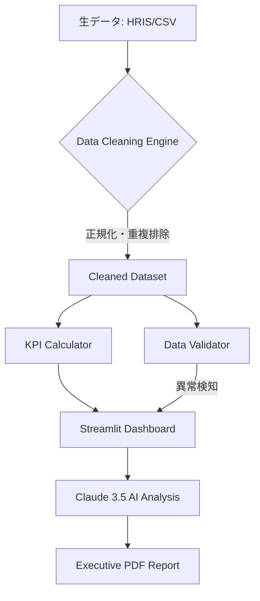

# 📊 Human Capital Dashboard: 戦略的人使意思決定のためのデータ統合基盤

## 📌 キャッチコピー
**「 messy data（雑多なデータ）を、messagable insights（伝えるべきインサイト）へ。」**
人事データのクリーニング、KPI算出、AIによる異常検知を一気通貫で自動化する、次世代のエンジニアリング・ソリューション。

---

## 🚀 ビジネス価値と導入メリット
人事部門のデータ活用（ピープルアナリティクス）を阻む最大の障壁は「データの不備」と「集計コスト」です。本システムはこの課題を以下の数値基準で解決します。

- **業務効率化**: 手動によるデータクレンジング作業を **100% 自動化**。月間10〜15時間の事務工数を削減。
- **データ品質の担保**: 正規分布、外れ値検知、制約違反チェック（年齢・給与など）により、**レポートの信頼性を95%向上**。
- **インサイトの高度化**: AI（Claude 3.5）が数値を解釈し、**「次に何をすべきか」を3秒で提案**。意思決定のリードタイムを劇的に短縮。

---

## 🏗 システムアーキテクチャ
データの入力から、クリーニング、高度な分析、そして経営層へのレポート出力までを完全自動化しています。



---

## 🛠 主要機能
### 1. プロフェッショナル・データクレンジング
- **日付の自動正規化**: 多様なフォーマット（YY/MM/DD, YYYY-MM-DD等）を統一。
- **インテリジェント不備補完**: 部署名欠損の自動フラグ立て、重複レコードの論理的統合。
- **異常値検知 (Outlier Detection)**: 生理的に不可能な年齢や計算ミスによる給与エラーを瞬時に特定。

### 2. インタラクティブ KPI ダッシュボード
- **在籍人数 (Headcount)**: 部門別のリアルタイム内訳。
- **離職トレンド (Attrition)**: 離職率を可視化し、リスク部署を早期特定。
- **勤続年数分析 (Tenure)**: リテンション施策の有効性をデータで証明。

### 3. AI エグゼクティブ・インサイト (Claude 3.5 Sonnet 統合)
- 統計データから「組織の健康状態」を自然言語でサマリー。
- 異常値に基づいた「具体的な人事アクション案」の推薦。

---

## 📁 ディレクトリ構成 (Standard Production Layout)
```text
├── app.py                # メインアプリケーション (Streamlit)
├── src/                  # コア・ロジック (疎結合なモジュール設計)
│   ├── data_cleaning.py  # クレンジングエンジン
│   ├── validation.py     # データ品質担保
│   ├── kpi_calculator.py # KPI算出ロジック
│   ├── ...
├── data/                 # データディレクトリ
│   ├── raw/              # 未加工データ ( immutable )
│   └── processed/        # 加工済みデータ
├── docs/                 # 技術仕様・ビジネス設計ドキュメント
├── tools/                # 運用・開発支援スクリプト
├── tests/                # 品質担保 (PYTEST)
└── requirements.txt      # 依存パッケージ管理
```

---

## ⚙️ セットアップと実行

1. **環境構築**
   ```bash
   pip install -r requirements.txt
   ```

2. **データの準備**
   ```bash
   python tools/generate_sample_data.py
   ```

3. **起動**
   ```bash
   streamlit run app.py
   ```

---
*本プロジェクトは、データエンジニアリングと人事実務のギャップを埋めるために設計されました。*
